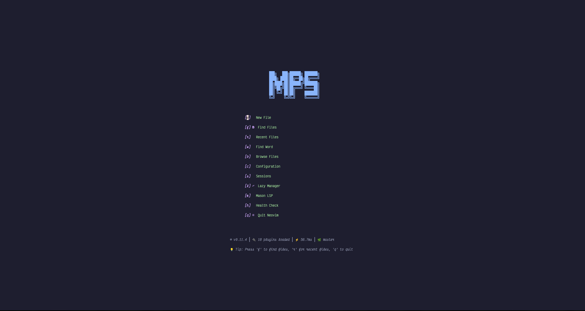

# 🚀 Advanced Neovim Configuration for Cloud Security Engineering

> **A comprehensive, modern Neovim configuration optimized for cloud security professionals, featuring AI-powered development tools, advanced LSP integration, and beautiful UI.**


## 📸 Screenshots



## ✨ Features

### 🎨 **Beautiful & Consistent Design**
- **Catppuccin Mocha** theme with full plugin integration
- Consistent color scheme across all UI elements
- Professional dark theme optimized for long coding sessions
- Custom terminal colors for perfect visual harmony

### 🤖 **AI-Powered Development**
- **Avante.nvim** - VS Code-like AI coding assistant with right sidebar
- **ChatGPT.nvim** - Intelligent 1Password integration for secure API key management
- **Copilot Chat** - Enhanced GitHub Copilot with custom prompts
- Smart API key detection and configuration guidance
- **Built with AI** - This entire configuration was rebuilt and optimized using GitHub Copilot Chat

### 🔧 **Advanced LSP & Tools**
- **20+ Language Servers** auto-installed via Mason
- **Cloud Security Focus** - Terraform, Ansible, Kubernetes, Docker support
- **Enhanced Diagnostics** - Ruff, ESLint, Shellcheck, and security scanners
- **Intelligent Completion** - LSP + Copilot + LuaSnip integration

### 🗂️ **Modern File Management**
- **Telescope** - Powerful fuzzy finder with multiple extensions
- **Obsidian Integration** - Three-domain personal knowledge management
- **Enhanced Markdown** - Live preview, beautiful rendering, headlines
- **Git Integration** - Gitsigns, Diffview, blame, conflict resolution

### 📝 **Productivity Features**
- **Smart Terminal** - VS Code-style integrated terminal
- **Buffer Management** - Modern tab/buffer handling with git indicators
- **Todo Comments** - Highlighted TODO/FIXME/NOTE tracking
- **Auto-formatting** - On-save formatting for multiple languages

## 🚀 Quick Start

### Prerequisites

- **Neovim 0.11+** (required for latest features)
- **Git** (for plugin management)
- **Node.js 22+** (for Copilot compatibility)
- **1Password CLI** (optional, for ChatGPT integration)

### Installation

```bash
# Backup existing configuration
mv ~/.config/nvim ~/.config/nvim.backup
mv ~/.local/share/nvim ~/.local/share/nvim.backup

# Clone this configuration
git clone https://github.com/kamikazestar/nvim ~/.config/nvim

# Start Neovim (plugins will auto-install)
nvim
```

### First Run Setup

1. **Let plugins install** (automatic on first startup)
2. **Configure AI tools** (optional):
   ```bash
   # For ChatGPT with 1Password
   eval $(op signin)
   
   # Or set environment variable
   export OPENAI_API_KEY="your-key-here"
   ```
3. **Check health**: `:checkhealth`
4. **View status**: `:ChatGPTStatus`, `:AvanteBuild`

## 📚 Documentation

- **[🔌 Plugin Guide](docs/PLUGINS.md)** - Comprehensive plugin documentation
- **[⌨️ Keybindings](docs/KEYBINDINGS.md)** - Complete keybinding reference
- **[🤖 AI Tools Setup](docs/AI_SETUP.md)** - AI plugin configuration guide
- **[🔧 LSP Configuration](docs/LSP.md)** - Language server setup and customization

## 🎯 Target Audience

This configuration is specifically designed for:

- **Cloud Security Engineers** - Enhanced tooling for AWS, Azure, GCP
- **DevOps Professionals** - Terraform, Ansible, Kubernetes support
- **Python Developers** - Advanced security-focused Python tooling
- **Go Developers** - Cloud-native Go development features
- **Security Researchers** - Integrated security scanning and analysis

## 🏗️ Architecture

```
~/.config/nvim/
├── init.lua                 # Entry point
├── lua/
│   ├── core/               # Core configuration
│   │   ├── keymaps.lua     # Global keybindings
│   │   └── options.lua     # Neovim options
│   └── plugins/            # Plugin configurations
│       ├── alpha-nvim.lua  # Dashboard
│       ├── avante.lua      # AI coding assistant
│       ├── chatgpt.lua     # ChatGPT integration
│       ├── completion.lua  # Autocompletion
│       ├── lsp.lua         # Language servers
│       ├── obsidian.lua    # Knowledge management
│       └── ...
└── docs/                   # Documentation
```

## 🔥 Highlights

### AI-Powered Workflow
```lua
-- Smart ChatGPT integration with 1Password
:ChatGPTStatus              -- Check configuration
:ChatGPT                    -- Open with auto-setup
<leader>gpt                 -- Quick chat access
```

### Advanced LSP Features
```lua
-- Multi-language support with security focus
:Mason                      -- Package manager
gd                          -- Go to definition
<leader>ca                  -- Code actions
<leader>f                   -- Format code
```

### Knowledge Management
```lua
-- Obsidian three-domain system
<leader>on                  -- New note
<leader>ot                  -- Today's daily note
<leader>os                  -- Search notes
<leader>onp                 -- New personal note
```

## � AI-Assisted Development

> **This configuration showcases the future of development workflows**

This entire Neovim configuration was **rebuilt from scratch using GitHub Copilot Chat**, demonstrating how AI can enhance and accelerate development processes:

### 🚀 **Development Process**
- **Complete Rebuild** - Legacy configuration transformed into modern, optimized setup
- **AI-Guided Architecture** - Plugin organization and configuration structure designed with AI assistance
- **Intelligent Documentation** - Comprehensive docs generated and refined through AI collaboration
- **Best Practices** - Security patterns and cloud-native optimizations suggested by AI
- **Error Resolution** - Complex debugging and configuration issues solved iteratively with AI

### 🎯 **AI Integration Layers**
1. **Development Tools** - Avante, ChatGPT, Copilot Chat for daily coding
2. **Configuration** - This setup itself built using AI assistance
3. **Documentation** - All guides and references AI-enhanced
4. **Optimization** - Performance and security improvements AI-suggested

*This configuration serves as a practical example of AI-human collaboration in creating professional development environments.*

---

## �🤝 Contributing

While this is a personal configuration, you're welcome to:

- **🐛 Report Issues** - Found a bug? Please open an issue
- **💡 Suggest Features** - Have ideas? Start a discussion
- **📖 Improve Docs** - Documentation improvements are always welcome
- **🍴 Fork & Adapt** - Make it your own!

### Development Setup

```bash
# Fork the repository
git clone https://github.com/your-username/nvim

# Create feature branch
git checkout -b feature/amazing-improvement

# Test thoroughly
nvim --clean -u init.lua

# Submit PR with clear description
```

## 🔧 Customization

### Adding Your Own Plugins

```lua
-- lua/plugins/your-plugin.lua
return {
    "author/plugin-name",
    config = function()
        -- Your configuration
    end
}
```

### Modifying Keybindings

```lua
-- lua/core/keymaps.lua
vim.keymap.set("n", "<leader>your", ":YourCommand<cr>", { desc = "Your description" })
```

### Theme Customization

```lua
-- lua/plugins/catppuccin.lua
-- Modify the Catppuccin configuration
```

## 📊 Plugin Status

| Plugin | Status | Purpose | Documentation |
|--------|--------|---------|---------------|
| 🎨 Catppuccin | ✅ Active | Theme | [Plugin Guide](docs/PLUGINS.md#catppuccin) |
| 🤖 Avante | ✅ Active | AI Assistant | [AI Setup](docs/AI_SETUP.md#avante) |
| 💬 ChatGPT | ✅ Active | AI Chat | [AI Setup](docs/AI_SETUP.md#chatgpt) |
| 🔍 Telescope | ✅ Active | Fuzzy Finder | [Plugin Guide](docs/PLUGINS.md#telescope) |
| 🗂️ Obsidian | ✅ Active | Knowledge Mgmt | [Plugin Guide](docs/PLUGINS.md#obsidian) |
| 🔧 LSP | ✅ Active | Language Servers | [LSP Guide](docs/LSP.md) |

## 🎓 Learning Resources

### Neovim Configuration
- [Neovim Documentation](https://neovim.io/doc/)
- [Lua Guide](https://github.com/nanotee/nvim-lua-guide)
- [Plugin Development](https://github.com/nvim-lua/nvim-lua-guide)

### Configuration Inspiration
- [Darko Mesaros Stream](https://www.youtube.com/watch?v=kPnYFsXml-I) - Original inspiration
- [NvChad](https://nvchad.com/) - Modern config framework
- [LunarVim](https://www.lunarvim.org/) - IDE-like config

## 🐛 Troubleshooting

### Common Issues

**Plugins not loading?**
```bash
:Lazy sync                  # Sync plugins
:checkhealth lazy           # Check plugin health
```

**LSP not working?**
```bash
:LspInfo                    # Check LSP status
:Mason                      # Install language servers
:checkhealth lsp            # Check LSP health
```

**AI tools not configured?**
```bash
:ChatGPTStatus              # Check ChatGPT setup
:AvanteBuild                # Build Avante
```

### Getting Help

1. **Check Documentation** - Read the relevant docs first
2. **Health Check** - Run `:checkhealth` for diagnostics
3. **Search Issues** - Look for similar problems
4. **Open Issue** - Provide detailed information

## 🙏 Acknowledgments

Special thanks to:

- **[GitHub Copilot Chat](https://github.com/features/copilot)** - This entire configuration was rebuilt, optimized, and documented using GitHub Copilot Chat, showcasing the power of AI-assisted development
- **[Darko Mesaros](https://github.com/darko-mesaros)** - Original inspiration and AWS developer advocacy
- **[Neovim Team](https://github.com/neovim/neovim)** - For the amazing editor
- **[Plugin Authors](docs/PLUGINS.md)** - For their incredible work
- **[Catppuccin Team](https://github.com/catppuccin)** - For the beautiful theme

## 📄 License

This configuration is distributed under the [MIT License](LICENSE).

---

<div align="center">

**⭐ If this configuration helped you, consider giving it a star!**

[📚 Documentation](docs/) • [🐛 Issues](https://github.com/kamikazestar/nvim/issues) • [💬 Discussions](https://github.com/kamikazestar/nvim/discussions)

</div>